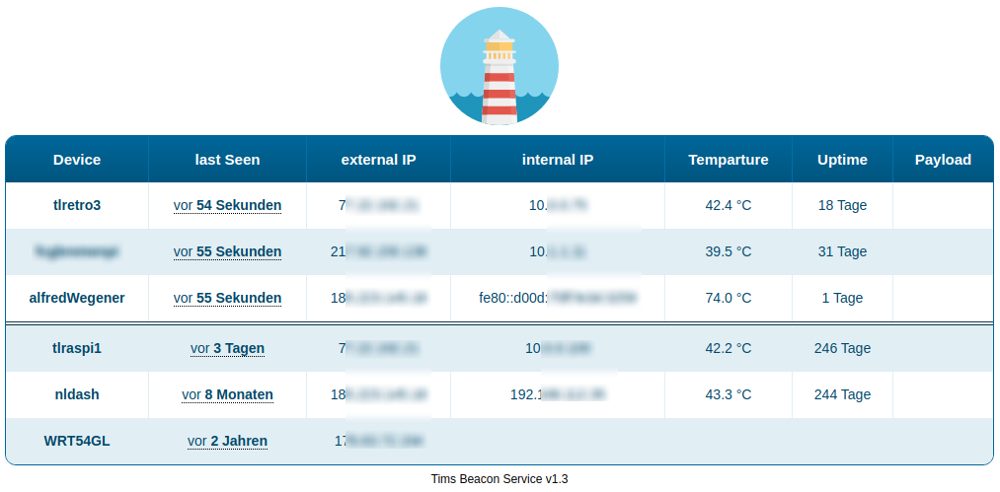

# Tims Beacon Service v1.5.3
**Tims Beacon-Service keeps track of all your computers (uptime, cpu-temperature, IPs, last time seen, uptime of system, etc.).**

It is especially helpful for **Raspberry PIs** when you don't have a screen attached.
* easy to install
* Simple overview over all monitored systems
* ready for self-hosting, SQL-DB required

By the way: Don't mix up **Beacons** with delicious **Bacon** ! :)

Server Requirements
------------
* WebServer with PHP 5.6 or higher
* MySQL Database

Installation on Server
------------
1. Copy all files from **/serverFiles** to your server directory.
   
2. Security: **Make sure** you copied .htaccess & .htpasswd and as well inserted your credentials to ensure nobody except you can view your vulnurable information. Without this files everyone could access your Beacon-Information-Page!
   
If you want you can use a .htpasswd-generator to create your .htaccess & .htpasswd files. For example you can use this one: https://www.askapache.com/online-tools/htpasswd-generator/

3. Enter your **MySQL DB Credentials** into **db_connection.php**.
4. Use the */serverFiles/createTable.sql* on your DB to create initale Table-Structure
5. Open https://YOURSERVER/lastKnownIp.php to view the data send by the clients.

Installation on Client
------------
1. Just copy the **/clientFiles/sendBeacon.sh** to your Clients home folder
2. Change the **deviceName** Variable & the serveradress in the sendBeacon.sh
3. Make sure *sendBeacon.sh* is executable: **chmod +x sendBeacon.sh**
4. Add the following line to your crontab (type **crontab -e** in your console) this will call the script every minute:

`* * * * * bash sendBeacon.sh`

Payloads
-------------
* You can send payloads (any String) with the beacons

help - I have no curl
---------------------
In case you don't have _curl_ on your device (for example on some minimal _OpenWRT Routers_) you can replace it in the Bash-File with **http PUT** instead. The package needed to be install in openWrt is called **httpie**.

`http PUT https://YOURSERVER/hey.php whois=DEVICENAME`

Project details
-------------
Author: Tim Lüdtke (https://timluedtke.de)

Version 1.5.3 (Aug 2021)

Graphics
----
Logo-Image is licensed under CC-BY-3.0 by author: pixelbuddha
Source: https://commons.wikimedia.org/wiki/File%3ABeacon_ballonicon2.svg
